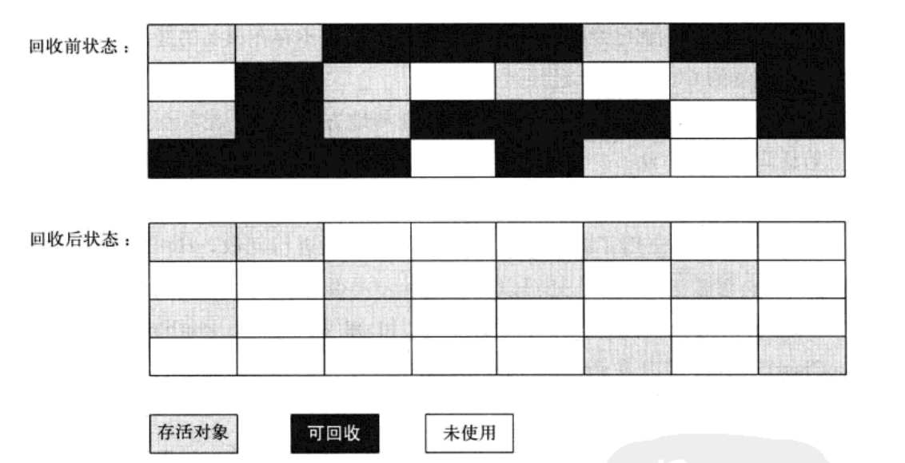
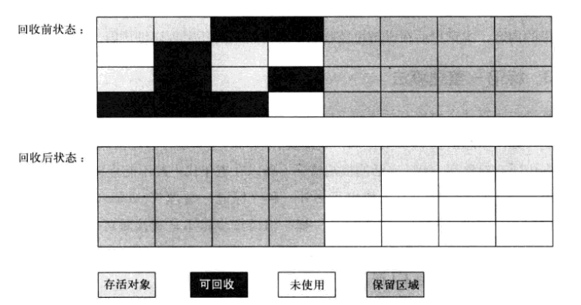
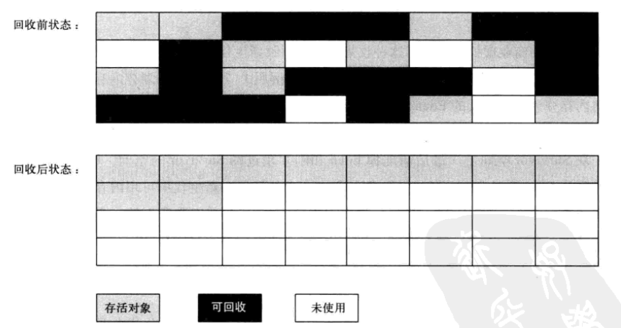
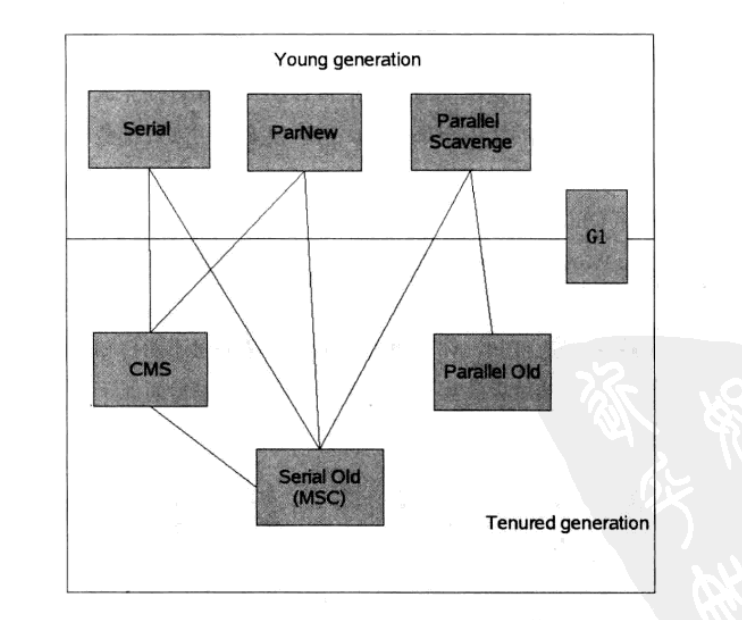
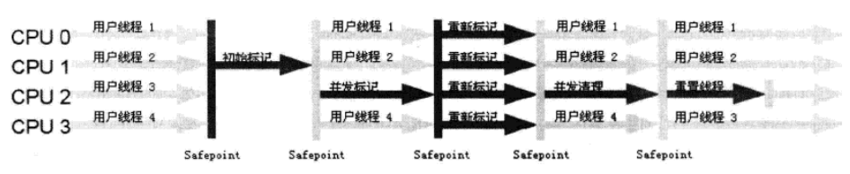

- [java内存区域](#java内存区域)
  - [概述](#概述)
  - [运行时数据区域](#运行时数据区域)
    - [程序计数器](#程序计数器)
    - [java虚拟机栈](#java虚拟机栈)
    - [本地方法栈](#本地方法栈)
    - [堆](#堆)
    - [方法区](#方法区)
    - [运行时常量池](#运行时常量池)
  - [对象访问](#对象访问)
- [垃圾回收](#垃圾回收)
  - [判断对象可以回收](#判断对象可以回收)
    - [引用计数法](#引用计数法)
    - [根搜索方法](#根搜索方法)
    - [引用](#引用)
    - [自我拯救](#自我拯救)
    - [回收方法区](#回收方法区)
  - [垃圾收集算法](#垃圾收集算法)
    - [标记清除算法](#标记清除算法)
    - [复制算法](#复制算法)
    - [标记整理法](#标记整理法)
    - [分代收集法](#分代收集法)
  - [垃圾收集器](#垃圾收集器)
    - [Serial 收集器](#serial-收集器)
    - [ParNew收集器](#parnew收集器)
    - [Parallel  Scavenge收集器](#parallel--scavenge收集器)
    - [Serial Old收集器](#serial-old收集器)
    - [Parallel Old收集器](#parallel-old收集器)
    - [CMS收集器](#cms收集器)
    - [G1收集器](#g1收集器)

# java内存区域

## 概述
对于java来说，由于有JVM的存在，因此不需要关注内存泄漏等问题，但是如果一旦出现问题，如果不知道JVM相关只是是很麻烦的

## 运行时数据区域
JVM会在**运行java程序时**将其管理的内存划分为几个不同的数据区域

### 程序计数器
程序计数器可以看做当前线程所执行的字节码的**行号指示器**  
字节码通过改变计数器的值来选择下一条需要执行的指令

java的多线程是通过线程轮流切换并且分配处理器执行时间的方式来实现的，**为了线程切换后能够恢复到正确的执行位置**，每个线程都有一个独立的程序计数器

⚠️：这个内存区域是唯一一个在java虚拟机中没有规定`OutofMemoryError`情况的区域

### java虚拟机栈
java虚拟机栈也是线程私有的，**生命周期与线程线程相同**  
每个方法被执行的时候都有一个栈帧，存储变量表、方法出口等信息

这个内存区域有两种异常状况  
* StackOverflowErroe
* OutOfMemoryError

### 本地方法栈
与虚拟机栈大致相同，但是是为了本地方法进行服务的

### 堆
java堆是最大的一块内存区域，是线程共享的，在**虚拟机启动**的时候创建，目的就是用来存放对象实例，也是垃圾回收的主要工作区域  
⚠️：java堆可以处于物理上不连续的内存空间中，只需要逻辑上是连续的就行了

### 方法区
方法区也是线程共享的内存区域，用于存储已经被虚拟机加载的类信息、常量、静态变量等数据

### 运行时常量池
常量池是方法区的一部分。Class文件中有一部分就是常量池，用于存储编译时产生的字面量和符号引用，在类加载后存放到方法去的运行时常量池中

## 对象访问
最简单的代码
```java
Object obj = new Object();
```
`Object obj`会映射到java栈的本地变量表中，作为一个reference类型的数据出现  
`new Object()`会创建一个新的对象，在java堆中分配一个结构化的内存空间  
对象的类型、父类等信息则存储在方法区中  

# 垃圾回收
## 判断对象可以回收
### 引用计数法
比较常见的一种方式是引用计数法，这种方法是给对象添加一个计数器，每次被引用之后就加一，相反则减一，如果对象的引用计数器为0则可以进行回收  
⚠️：但是这种方式有一个很大的问题，即可能出现循环引用的问题，因此一般不会使用这种方式

### 根搜索方法
通过GCRoot进行向下的搜索，如果不能和GCRoot建立链接的话就说明这个对象是可以进行回收的  
可以被认为是GCRoot的对象有下面几种  
* 虚拟机栈中的引用变量
* 方法区中的类静态属性引用的变量
* 方法区中的常量引用的变量
* 本地方法栈中引用的变量

这些对象可以作为GCRoot的主要原因是，**垃圾回收主要发生在堆上，因此选择不是堆的一些内存区域中的变量作为GCRoot有较高可靠性**

### 引用
引用一般表示存储另一个变量起始地址的对象  
java中有四种引用  
* 强引用：只要这个引用还在就永远不会被回收掉
* 软引用：系统将要发生溢出前，会进行软引用的回收
* 弱引用：只能生存到下一次垃圾回收之前
* 虚引用：完全不影响对象生存

### 自我拯救
在java中判定对象是否死亡至少要经过两次标记的过程
1. 进行引用链分析之后，判断是否存在与GCRoots之间的联系
2. 进行一次筛选来判断是否有必要执行finalize方法
   1. 如果对象没有覆盖过finalize方法也没有调用过finalize方法,那么JVM判定对象死亡并且进行回收
   2. 如果对象覆盖了finalize方法但是没有调用过，这时会将其放进一个F-Queue中，由一个低优先级的Finalizer去进行处理。如果在等待的过程中，在finalize方法中又与其他对象建立了联系的话就可以逃脱GC

⚠️：任何一个对象的finalize方法都只会被系统自动调用一次，如果对象面临第二次回收的话，那么它的的finalize方法不会被再次执行

java中的finalize方法是为了C/C++程序员做出的妥协，其代价非常大，一般尽量不要使用这一种方法

### 回收方法区
方法区中的垃圾回收的效率不高，但是还是存在的  
这里的垃圾回收主要包含两个部分：  
* 废弃常量:如字符串常量`"abc"`如果没有字符串对象引用的话就会被回收
* 无用的类：需要满足以下三个条件  
  * 该类的所有实例已经回收
  * 加载该类的ClassLoader已经进行回收
  * 该类的Class对象没有任何引用，无法通过反射进行访问

## 垃圾收集算法

### 标记清除算法
最基础的垃圾回收算法是标记清除算法
1. 标记所有需要进行回收的对象
2. 标记完成之后统一回收掉所有被标记的对象



其主要有两个缺点：  
* 效率问题：标记和清除的效率都不高
* 空间问题：标记清除之后会产生大量的内存碎片

### 复制算法
复制算法将可用内存划分为大小相等的两块，每一次只使用其中的一块，当这一块的内存使用完了，就将存活的对象复制到另一块上面，然后把使用过的内存空间一次清理掉  


这种算法的优点是**不用考虑内存碎片等问题，只需要按顺序分配内存即可**，但是代价是**可以使用的内存空间缩小为原来的一半**

现在的商业虚拟机都使用这种收集算法来回收**新生代**

新生代的对象中绝大部分都是马上都会死亡的,因此将内存划分为一块较大的Eden空间和两块较小的Survivor空间。**如果发生回收的话，将Eden和Survivor中存活的对象全部移到另一块Survivor中，然后清除掉原来的空间**。当Survivor不够用的时候，将其中的对象移到老年代中。

### 标记整理法
老年代中一般使用标记整理法
1. 标记所有需要回收的对象
2. 将存活的对象向一端进行移动，清除掉边界之外的内存


### 分代收集法
上述思想的统一，根据不同的对象存活周期将内存划分成若干块，每一块使用不同的垃圾回收算法

## 垃圾收集器

如果两个垃圾收集器之间存在连线的话，说明这两个垃圾收集器可以搭配进行使用

### Serial 收集器
Serial收集器是单线程的，进行垃圾收集的时候需要**暂停所有其他的工作线程**。  
其最大的优点在于：简单而高效，没有线程交互的开销  


对于用户的桌面应用程序场景中来说，分配给虚拟机管理的内存空间不会很大，因此回收的时间并不会很长，这个时间是完全可以接受的。


### ParNew收集器
ParNew收集器是Serial收集器的多线程版本（只是可以多线程进行收集，**并不能垃圾回收和用户线程同时进行**）  
这个收集器是server模式中首选的新生代收集器，因为只有Serial和它能够和CMS收集器进行合作  
这个收集器能够保证在多核的情况下，效率大幅度超过Serial收集器，但是在单核甚至少核的情况下效率并不能保证比Serial更高

### Parallel  Scavenge收集器
这个收集器也是一个新生代**收集器**，基本上和ParNew一致，与其他收集器最大的不同在于
> 达到一个可控制的吞吐量（运行用户代码时间/总时间）

* 停顿时间越短越适合用户交互的程序，提高响应速度
* 高吞吐量则能够高效利用CPU时间，尽快完成程序的运算任务，适合在后台运算而不需要大量交互的任务

### Serial Old收集器
Serial收集器的老年代版本，一个单线程收集器，使用标记整理算法

### Parallel Old收集器
主要用于与Parallel Scavenge收集器搭配进行使用

### CMS收集器
CMS收集器是**以获取最短回收停顿时间为目标的收集器**，主要用于服务端中



主要有以下几个步骤：
1. 初始标记：标记GCRoot能直接管理到的对象。速度很快
2. 并发标记：GCRoot Tracing
3. 重新标记：修正在并发标记的过程中，因为用户继续运行导致变动的对象
4. 并发清除

但是CMS存在以下几个问题
* 对于CPU资源敏感
* 无法处理浮动垃圾（在回收过程中产生的垃圾）
* 使用标记清除法，存在内存碎片

### G1收集器
现在比较前沿的收集器技术，主要比CMS优秀在
* 标记整理法
* 非常精确控制停顿

G1将整个java堆划分为多个大小固定的独立区域，并且跟踪区域里面垃圾的堆积程度，在后台维护一个优先列表，优先回收垃圾最多的区域。
